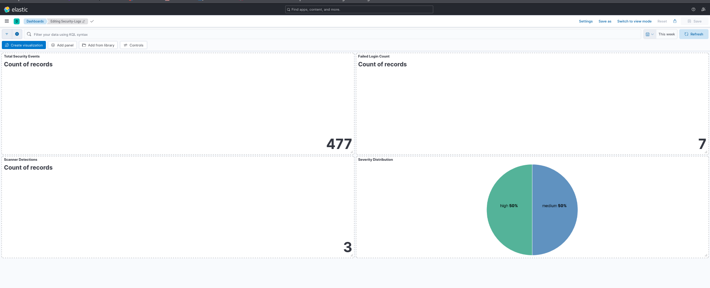
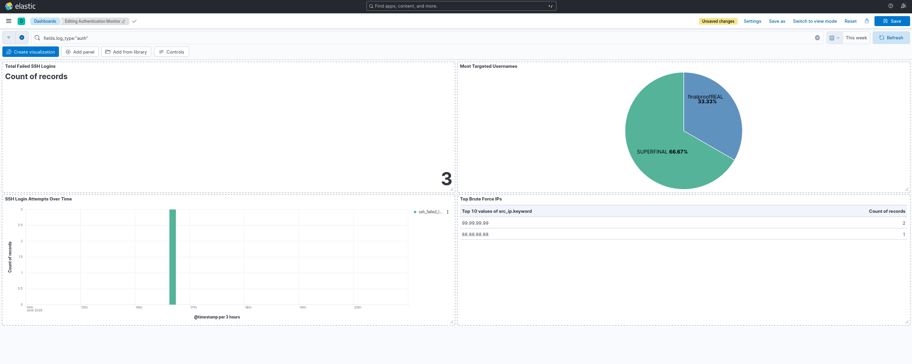
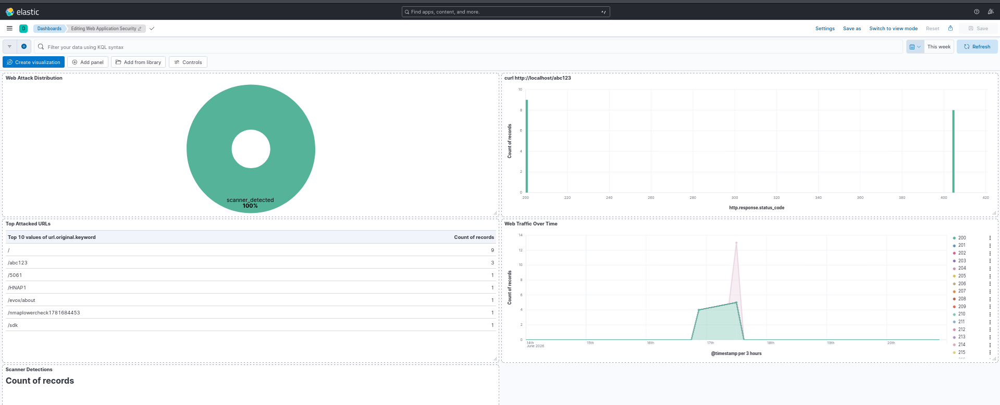
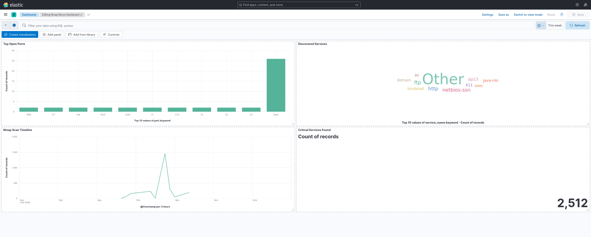

# Post-Incident Report
### ApexPlanet Internship – Task 05 Capstone Project

---

# Incident Information

| Field | Details |
|---------|-----------|
| Incident ID | IR-2026-001 |
| Incident Title | Multi-Source Security Event Investigation |
| Report Type | Post-Incident Analysis |
| Analyst | Shubham Chaurasiya |
| Investigation Period | Day 28 |
| Severity | Medium |
| Status | Closed |
| Environment | ELK Stack Security Monitoring Lab |

---

# Executive Summary

During routine monitoring activities within the ELK-based SIEM environment, multiple suspicious events were identified across authentication logs, web application logs, and reconnaissance data. The observed activities included failed authentication attempts, web enumeration requests, scanner detections, and reconnaissance scans against exposed services.

A structured incident response process was initiated to investigate the events, determine their potential impact, identify indicators of compromise, and document findings.

The investigation concluded that the activities originated from controlled laboratory simulations performed for educational and defensive monitoring purposes. No evidence of an actual compromise was identified within the monitored environment.

---

# Incident Overview

## Detection Sources

The incident was identified through multiple Kibana dashboards designed for SOC monitoring.

### Security Logs Dashboard

Detected:

- Elevated failed authentication events.
- Scanner-related activity.
- Changes in event severity distribution.

### Authentication Monitor

Detected:

- Multiple failed SSH login attempts.
- Repeated targeting of specific usernames.
- Concentrated activity from a limited number of source IP addresses.

### Web Application Security Dashboard

Detected:

- Enumeration attempts.
- Scanner-generated HTTP requests.
- Requests targeting unusual application endpoints.

### Nmap Recon Dashboard

Detected:

- Service discovery activity.
- Enumeration of exposed ports.
- Identification of critical network services.

---

# Incident Timeline

| Time Phase | Activity |
|------------|------------|
| Detection | Security dashboards reported abnormal activity. |
| Triage | Authentication and web logs were reviewed. |
| Investigation | Source IPs and targeted assets were identified. |
| Correlation | Events from multiple dashboards were linked together. |
| Impact Assessment | Scope of activity was evaluated. |
| Containment Review | Defensive recommendations were documented. |
| Closure | Incident classified as authorized laboratory simulation. |

---

# Indicators of Activity

## Authentication Indicators

Observed behaviors included:

- Failed SSH authentication attempts.
- Username enumeration attempts.
- Repeated login failures from the same sources.

### Targeted Usernames

Examples observed:

- SUPERFINAL
- finalproofREAL

### Source IP Addresses

Examples observed:

- 99.99.99.99
- 88.88.88.88

---

# Web Application Indicators

The investigation identified suspicious web requests commonly associated with automated discovery tools.

## Frequently Accessed Endpoints

Examples included:

```
/
/abc123
/5061
/HNAP1
/evox/about
/sdk
/nmaplowercheck...
```

These patterns closely resemble reconnaissance behavior performed by vulnerability scanners and Nmap NSE scripts.

---

# Reconnaissance Indicators

Nmap XML logs revealed extensive service enumeration activity.

The following services were identified during analysis:

- FTP
- SSH
- HTTP
- NetBIOS
- MySQL
- Java RMI
- IRC
- Bind Shell
- X11

Open services indicate the exposed attack surface available to an attacker conducting reconnaissance.

---

# Evidence Collected

The following evidence was collected during the investigation.

---

## Evidence 1: Security Monitoring Dashboard

Purpose:

Provide an overview of security events and severity distribution.

### Screenshot

[](screenshots/security-dashboard.png)

---

## Evidence 2: Authentication Investigation

Purpose:

Review authentication attempts and targeted accounts.

### Screenshot

[](screenshots/auth-dashboard.png)

---

## Evidence 3: Web Application Investigation

Purpose:

Identify suspicious requests and scanner detections.

### Screenshot

[](screenshots/web-dashboard.png)

---

## Evidence 4: Reconnaissance Investigation

Purpose:

Analyze discovered services and exposed ports.

### Screenshot

[](screenshots/nmap-dashboard.png)

---

# Event Correlation Analysis

The investigation correlated events across multiple log sources.

The following sequence was observed:

1. Reconnaissance activity identified exposed services.
2. Web enumeration requests targeted common endpoints.
3. Authentication attempts focused on specific usernames.
4. Security dashboards reflected increased event counts.
5. Investigation confirmed the activity originated from controlled simulations.

Cross-source correlation significantly improved visibility and reduced investigation time.

---

# Impact Assessment

## Systems Affected

No production systems were affected.

The investigation was conducted entirely within a controlled laboratory environment.

---

## Data Exposure

No evidence of:

- Unauthorized access,
- Privilege escalation,
- Malware execution,
- Data exfiltration,
- Persistence mechanisms

was identified.

---

## Business Impact

As this activity occurred within an educational environment, the operational impact was assessed as:

### Low

The incident provided valuable insight into SOC workflows without affecting business operations.

---

# Root Cause Analysis

The identified activities originated from intentionally executed security simulations designed to validate detection capabilities.

These activities included:

- Nmap reconnaissance scans,
- Scanner-generated HTTP requests,
- Authentication attack simulations.

The purpose of these simulations was to verify that the SIEM solution could successfully collect, process, visualize, and investigate suspicious events.

---

# Containment and Response Actions

The following actions were documented as part of the response process:

- Reviewed affected log sources.
- Verified event authenticity.
- Correlated evidence across dashboards.
- Assessed potential impact.
- Documented indicators.
- Recorded lessons learned.
- Closed the investigation following validation.

---

# Lessons Learned

This investigation highlighted several important operational lessons.

## Technical Lessons

- Log normalization improves investigations.
- Cross-dashboard correlation accelerates triage.
- Proper field extraction increases detection accuracy.
- Visualization simplifies incident analysis.

---

## Operational Lessons

- Structured workflows improve consistency.
- Evidence preservation is essential.
- Documentation is a critical SOC function.
- Validation prevents false-positive escalation.

---

# Recommendations

Future improvements include:

- Implement Elastic alerting.
- Introduce automated notification mechanisms.
- Integrate threat intelligence feeds.
- Add GeoIP enrichment.
- Develop Sigma-based detection rules.
- Expand monitoring to additional log sources.
- Automate incident response playbooks.

---

# Incident Closure

Following comprehensive analysis, the investigation determined that all observed activities were generated within an authorized laboratory environment for educational purposes.

No malicious compromise occurred, and the SIEM implementation successfully demonstrated its capability to detect, correlate, investigate, and document security events across multiple data sources.

---

# Analyst Statement

This investigation demonstrates the practical application of SIEM technologies and incident response methodologies in a simulated Security Operations Center environment. The experience gained through this exercise strengthened analytical, investigative, and defensive cybersecurity skills aligned with real-world SOC operations.

---

**Report Status:** Closed

**Prepared By:** Shubham Chaurasiya

**Project:** ApexPlanet Internship – Task 05 Capstone Project
