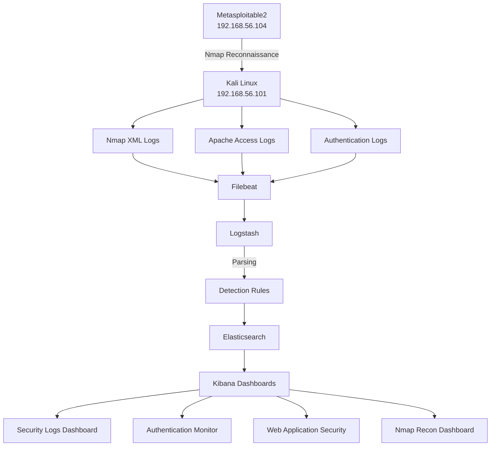

# Network Architecture Diagram
### ApexPlanet Internship – Task 05 Capstone Project

---

# Overview

This document illustrates the architecture and data flow of the Mini SIEM implementation developed using the ELK Stack. The objective of the architecture was to collect logs from multiple sources, process and enrich security events, store them centrally, and visualize them through Kibana dashboards to support Security Operations Center (SOC) activities.

---

# Lab Environment

| Component | Details |
|-----------|-----------|
| Analyst Machine | Kali Linux |
| Target Machine | Metasploitable2 |
| Virtualization Platform | Oracle VirtualBox |
| Network Type | Host-Only Network |
| ELK Stack Version | 8.19.16 |
| Monitoring Role | SOC Analyst (Simulation) |

---

# Network Addressing

| Asset | IP Address | Purpose |
|---------|------------|-----------|
| Kali Linux | 192.168.56.101 | Analyst Workstation & ELK Server |
| Metasploitable2 | 192.168.56.104 | Vulnerable Target System |
| Elasticsearch | localhost:9200 | Event Storage |
| Logstash | localhost:5044 | Event Processing |
| Kibana | localhost:5601 | Visualization |
| Filebeat | Local Agent | Log Collection |

---

# High-Level Architecture

```text
                    ┌────────────────────┐
                    │   Metasploitable2  │
                    │ 192.168.56.104     │
                    │                    │
                    │  FTP (21)          │
                    │  SSH (22)          │
                    │  HTTP (80)         │
                    │  Samba (445)       │
                    │  MySQL (3306)      │
                    │  Tomcat (8180)     │
                    │  Root Shell (1524) │
                    └─────────┬──────────┘
                              │
               Reconnaissance │
           (Nmap Enumeration) │
                              ▼
┌──────────────────────────────────────────────────┐
│                  Kali Linux                      │
│               192.168.56.101                     │
│                                                  │
│  ┌───────────┐      ┌──────────────────┐         │
│  │   Nmap    │      │ Apache Services  │         │
│  └─────┬─────┘      └────────┬─────────┘         │
│        │                     │                   │
│        │                     │                   │
│        ▼                     ▼                   │
│    Nmap XML Logs       Apache Access Logs        │
│                                                  │
│              Authentication Logs                │
│                  (/var/log/auth.log)            │
└──────────────────────┬──────────────────────────┘
                       │
                       ▼
              ┌─────────────────┐
              │   Filebeat      │
              │ Log Collection  │
              └────────┬────────┘
                       │
                       ▼
              ┌─────────────────┐
              │   Logstash      │
              │ Parsing         │
              │ Enrichment      │
              │ Detection Rules │
              └────────┬────────┘
                       │
                       ▼
              ┌─────────────────┐
              │ Elasticsearch   │
              │ Event Storage   │
              │ real-logs-*     │
              └────────┬────────┘
                       │
                       ▼
              ┌─────────────────┐
              │    Kibana       │
              │ Dashboards      │
              │ Investigation   │
              └─────────────────┘
```

---

# GitHub Mermaid Diagram

GitHub supports Mermaid diagrams natively. The following diagram provides a visual representation of the implemented architecture.



---

# Log Sources

The SIEM solution monitored multiple log sources.

## Authentication Logs

```text
/var/log/auth.log
```

Purpose:

- Failed login detection
- SSH monitoring
- Authentication investigations

---

## Apache Access Logs

```text
/var/log/apache2/access.log
```

Purpose:

- Web request monitoring
- Scanner identification
- HTTP status analysis

---

## Nmap XML Logs

```text
/var/log/nmap/*.xml
```

Purpose:

- Open port discovery
- Service enumeration
- Reconnaissance tracking

---

# Data Flow Explanation

The implemented data flow followed these stages:

### Step 1 – Event Generation

Security events were generated through:

- Authentication simulations,
- Web activity,
- Nmap reconnaissance scans.

---

### Step 2 – Collection

Filebeat continuously monitored configured log files and forwarded events to Logstash.

---

### Step 3 – Processing

Logstash enriched incoming events by:

- Applying parsing rules,
- Extracting fields,
- Assigning severity,
- Adding tags,
- Classifying activity types.

Examples included:

```text
scanner_detected
nmap_scan
failed_login
successful_login
```

---

### Step 4 – Storage

Processed events were indexed within Elasticsearch.

Example indices:

```text
real-logs-*
```

This enabled centralized search and investigation.

---

### Step 5 – Visualization

Kibana dashboards transformed raw logs into actionable intelligence through visualizations and metrics.

Implemented dashboards included:

- Security Logs Dashboard,
- Authentication Monitor,
- Web Application Security,
- Nmap Recon Dashboard.

---

# Security Monitoring Workflow

```text
Detect
   ↓
Investigate
   ↓
Correlate
   ↓
Assess Impact
   ↓
Document Findings
   ↓
Recommend Actions
   ↓
Close Incident
```

---

# Architecture Benefits

The implemented design provided several advantages:

- Centralized log visibility.
- Faster security investigations.
- Improved event correlation.
- Practical SOC workflow simulation.
- Scalable architecture for future enhancements.
- Hands-on experience with industry-standard SIEM technologies.

---

# Conclusion

The architecture developed during this capstone project successfully demonstrated the complete lifecycle of security monitoring within a laboratory environment. By integrating multiple log sources into the ELK Stack and visualizing them through Kibana, the solution provided practical experience in log collection, detection engineering, investigation, and incident response.

This architecture serves as a foundational SIEM deployment model aligned with real-world Security Operations Center practices.
